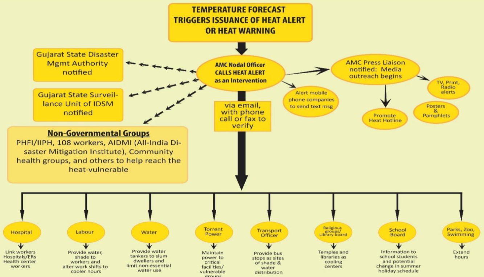

some function here

such as bib

---
class: center, middle

# Introduction

city

goals

outline

benefit

etc.

---

Atsumi's part

---

Atsumi's part

---
class: center, middle

# Wokflow

overview

temperature

slums

xxx

---
## Overview of HAP Workflow
**Pre-Heat Season (Jan-Mar)**
- AMC Nodal Officer coordinates inter-agency communications
- Health Department and Medical Professionals educate and prepare heat-related procedures
- 108 Emergency Service builds public awareness and **identifies vulnerable areas**
**Heat Season** (March-July)
- AMC Nodal Officer activates heat alerts when extreme heat events are forecasted + activates cooling centres and night shelters
- Community groups check on each other
**Post-Heat Season (July-Sept)**
- AMC Nodal Officer conducts evaluation and identifies key areas for improvement.

---
## Temperature workflow

```{r echo=FALSE, out.width='100%', fig.align='center'}
knitr::include_graphics('images/temp_workflow.png')
```

---
## Ahmedbad Heat Action Plan

```{r echo=FALSE, out.width='95%', fig.align='center', cache=TRUE, fig.cap="Source: [Ahmedabad Heat Action Plan 2019](https://www.nrdc.org/sites/default/files/ahmedabad-heat-action-plan-2019-update.pdf)"}

```

---
## Slums

Yifei's part

---

Yifei's part

---
## Integrating them (Will edit more after Young and Yifei)
**Slum detection**
The slum detection process can be conducted once a year, ideally before the hot season. This is inline with the general workflow for the Ahmedabad Heat Action Plan, where they have an action plan for the Pre-Heat Season (January- March) where they prepare for the heat season.

To give time for the geospatial team to generate estimates of slums, the process should begin ideally after the Post-Heat Season, but also with consideration to when satellite imagery might be least affected by cloud cover. Cloud cover is lowest in January, which is when the data collection process should start. Ideally the slum detection process should finish before March.

**Temperature Monitoring**
Temperature monitoring can be done via remote sensors, and we can incorporate it into the Nodal Officer’s workflow of monitoring and predicting extreme heat events.

---
class: inverse, center, middle

# Project Management

--
.pull-left[
**Reliable** 

**Sustainable** 

**Cost-effective**
]
--
.pull-right[
- Stakeholders engagement

- Timeline

- Spending plan

- Quality control 
]
---
class: center, middle

# Stakeholders engagement

```{r echo=FALSE, out.width='90%', fig.align='center'}
knitr::include_graphics('images/stakeholder.png')
```

---
class: center, middle

# Project timeline
```{r echo=FALSE, out.width='100%', fig.align='center'}
knitr::include_graphics('images/GANT.png')
```
---
class: center, middle

# Budget plan

---
class: center, middle

# Quality / risk management
```{r echo=FALSE, out.width='100%', fig.align='center'}
knitr::include_graphics('images/risk.png')
```
---
class: center, middle
# Summary
```{r echo=FALSE, out.width='100%', fig.align='center'}
knitr::include_graphics('images/workflow.png')
```