class: inverse, center, middle

# Problem Definition

--

```{r echo=FALSE}
library(RefManageR)
BibOptions(check.entries = FALSE,
           bib.style = "authoryear",
           cite.style = "authoryear",
           style = "markdown",
           hyperlink = TRUE,
           dashed = FALSE,
           max.names = 2,
           no.print.fields=c("doi", "url", "urldate", "issn"))
myBib <- ReadBib("./Library.bib", check = FALSE)
```

## Background 
.pull-left[
### Ahmadabad 
- Most populous city in India
- 5.5 million in 2011 (Census 2011)
- Est. 8 million in 2023
- City's growth from the textile industry in 1860's `r Citep(myBib, "barua2018legacies")`
- Cotton industry migrants in slums and *Chawls*
- Estimated 34% live in slums or *chawls* (low-quality housing) `r Citep(myBib, "killemsetty2013understanding")`
]

.pull-right[
```{r echo=FALSE, out.width='90%', fig.align='top, right'}
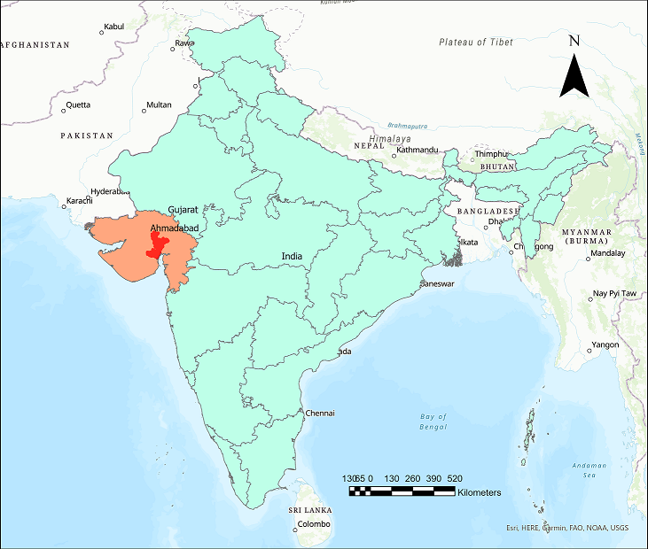
```
]

### The 2010 heatwave
- Temperature soared to 46.8 degree celcius 
- Heat-related excess mortality of 1344 people  `r Citep(myBib, "azhar2014heat")`
- first Heat Action plan published in 2013

---
## Problem statement
- Slums likely to have increased due to urban population growth (2.76% per annum), despite efforts to upgrade existing slums (Census 2011)
- Furthermore, census data is already outdated 
- The city's boundary expanded twice since last census, incorporating peripheral villages and municipalities 
- The locations of slums are unclear and need updated. 
- Urban geometry can contribute to heat islands and intra-urban temperature differences, eg. up to 6 degree in Delhi `r Citep(myBib, "yadav2018spatial")`


## Objective of the proposal
**Systematically identify the areas of high risk and vulnerable populations and neighbourhoods**, using EO data and incorporating into the City's workflow, so as to **direct heat mitigation resources to the most vulnerable areas**. 
---

## Benefits to the city
1. **Compliance with Sustainable Development Goals 11**
> Make cities and human settlements inclusive, safe, resilient and sustainable
2. **Compliance with the Sendai Framework**
> Enhansing disaster preparedness for effective response
 
## If no action taken, then... 
- Increased exposure to heatwave 
- *Human costs*: Increased mortality and morbidity esp the poor in LMICs `r Citep(myBib, "green2019impact")` through effects on the physical, natural and social systems, eg. food and water insecurity `r Citep(myBib, "romanello20212021")`
- *Economic costs*: Depress economic growth particularly in the poor tropical regions of the world `r Citep(myBib, "callahan2022globally")`
---
class: inverse, center, middle

# Project Approach

---
## Current Workflow: 2019 Heat Action Plan `r Citep(myBib, "amcAhmedabadHeatAction2019")`
### Four-pronged Strategy
- to increase public awareness and to communicate the risk of heat waves 
- to initiate an early warning system 
- to increase the capacity among health care professionals and 
- to reduce health exposure and promote adaptive measures 

### Ethos of the HAP = Protection of the vulnerable population
- Thus, **identification of high risk neighbourhoods** before the arrival of the summer is a key priority
- The HAP identifies outdoor workers, low-income communities or slum communities amongst the most vulnerable

---
## Timeline of Current Workflow `r Citep(myBib, "amcAhmedabadHeatAction2019")`
### Pre-Heat Season (Jan-Mar)
- AMC Nodal Officer coordinates inter-agency communications
- Health Department and Medical Professionals educate and prepare heat-related procedures
- 108 Emergency Service builds public awareness and **identifies vulnerable areas**

### Heat Season (March-July)
- **AMC Nodal Officer activates heat alerts when extreme heat events are forecast** + activates cooling centres and night shelters
- Community groups check on each other

### Post-Heat Season (July-Sept)
- AMC Nodal Officer conducts evaluation and identifies key areas for improvement.

---
## Overview of our proposed workflow
```{r echo=FALSE, out.width='100%', fig.align='center'}
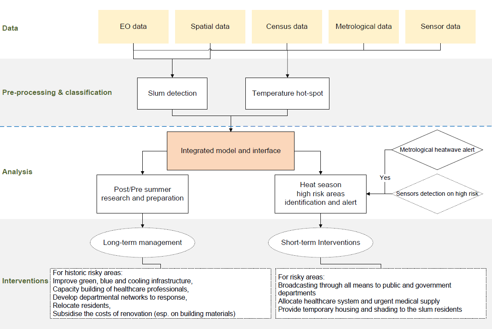
```

---
## Slums Detection

### Data

* EO data
  * High resolution imagery: from the [QuickBird satellite](https://earth.esa.int/eogateway/missions/quickbird-2)
> The QuickBird sensor provides a geometric resolution of 0.60 m in panchromatic mode and therefore basically allows for a delineation of the objects in slums `r Citep(myBib,"taubenbock2014")`.
  * Landsat MSS, TM, ETM+, available [here](https://developers.google.com/earth-engine/datasets/catalog/landsat)
  *	TerraSAR-X data, available [here](https://earth.esa.int/eogateway/missions/terrasar-x-and-tandem-x#data-section)

* Spatial data
  *	Street network: from the [OpenStreetMap](https://www.openstreetmap.org/#map=5/54.910/-3.432)

---
## Slums Detection
.pull-left[
### Workflow
```{r echo=FALSE, out.width='90%', fig.align='center'}
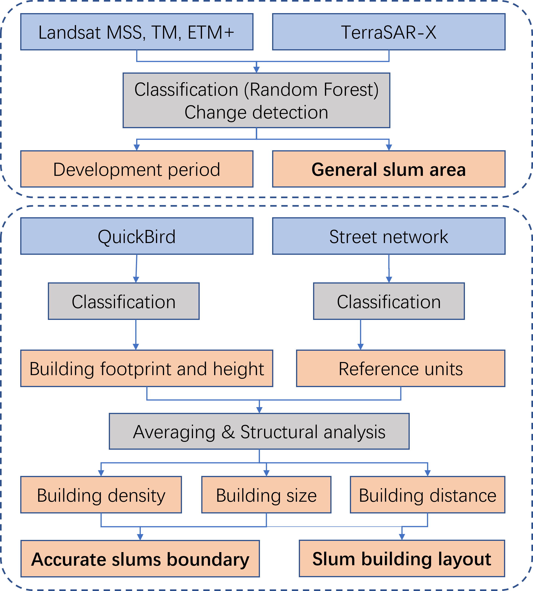
```
]
--
.pull-right[
### Expected results
```{r echo=FALSE, out.width='100%', fig.align='center'}
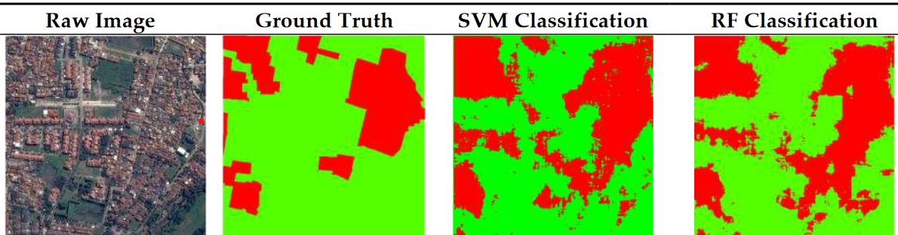
```
<small>General slums boundary for giving heatwave warning, Source: `r Citet(myBib, "leonita2018")`</small>
```{r echo=FALSE, out.width='100%', fig.align='center'}
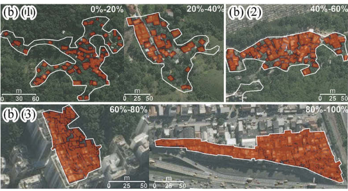
```
<small>Accurate slums boundary for upgrading, Source: `r Citet(myBib, "wurm2018a")`</small>
]

---
## Heatwave classification
### Data
* EO data from GEE
  * [Landsat 8 OLI/TIRS Collection 2](https://developers.google.com/earth-engine/datasets/catalog/LANDSAT_LC08_C02_T2_TOA)
  * MODIS

* [Meteorological data](https://mausam.imd.gov.in/ahmedabad/)
  * The average daily temperature by region
  * The average daily temperature by month (especially Summer)
  * Precipitation, Wind etc.
  
* Mortality data
  * Daily death toll (excluding accidental deaths)
  * The death toll by region (within a city only)
  * Source: `r Citet(myBib, "azhar2014")`

* Spatial data
  * Administrative boundary data:from the [OpenStreetMap](https://www.openstreetmap.org/relation/1953566#map=9/22.7298/72.3388)

---
## Heatwave classification
### Workflow
```{r echo=FALSE, out.width='150%', fig.align='center'}
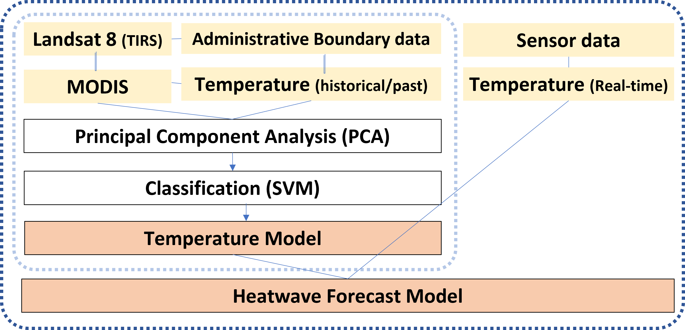
```

<small>Source: `r Citet(myBib, "wolf2013")`</small>

---
## Integrating both workflows
**Slum detection** process can be conducted every 5 years, before the heat season. 
- 5 years is a good period of updating the data as slums do not grow that quickly and is adequate. 
- This can be in the action plan for the **Pre-Heat Season (January- March)** where they prepare for the heat season.
- Cloud cover is lowest in January, which is when the data collection process should start. 
- There should be sufficient time for the slum detection process to finish by March.

**Temperature Monitoring** can be incorporated into the Nodal Officer’s workflow of monitoring and predicting extreme heat events.
- First output of a **Historic Temperature Vulnerability Map** can be updated yearly (pre-HS) with previous year's data and the slum boundary map when updated
- Second output of a **real-time prediction model** that can be updated daily (during HS) based on Meteorological Department's forecasts and additional sensors

---
## Integrating both workflows
### Expected output
```{r echo=FALSE, out.width='120%', fig.align='center'}
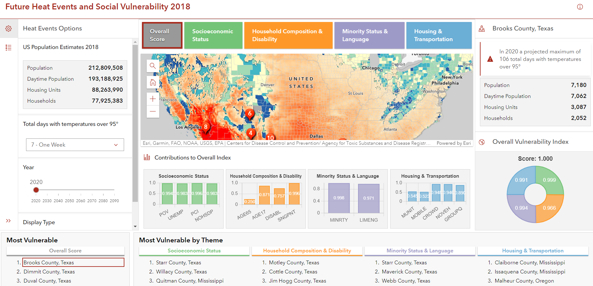
```

<small>Source: [Future Heat Events and Social Vulnerability 2018](https://geoxc-apps2.bd.esri.com/Climate/HeatVulnerability/index.html)</small>

---
## Using the outputs
Both outputs serve to help direct heat mitigation resources to the most vulnerable areas
- Pre-HS resources: Building medical infrastructure and capacity, educate residents on heat events
- Immediate resources: Water supply, public cooling centres and night shelters, medical services
- Long-term resources: Provide shaded public spaces and Ahmedabad Cool Roofs Program

Residents can also check the map for additional alerts if they are concerned
---
class: inverse, center, middle

# Project plan, risks and value for money

--
.pull-left[
**Reliable** 

**Cost-effective**

**Sustainable** 
]
--
.pull-right[
- Timeline & Stakeholder

- Budgeting

- Quality control 
]
---
## Stakeholders engagement
```{r echo=FALSE, out.width='100%', fig.align='center'}
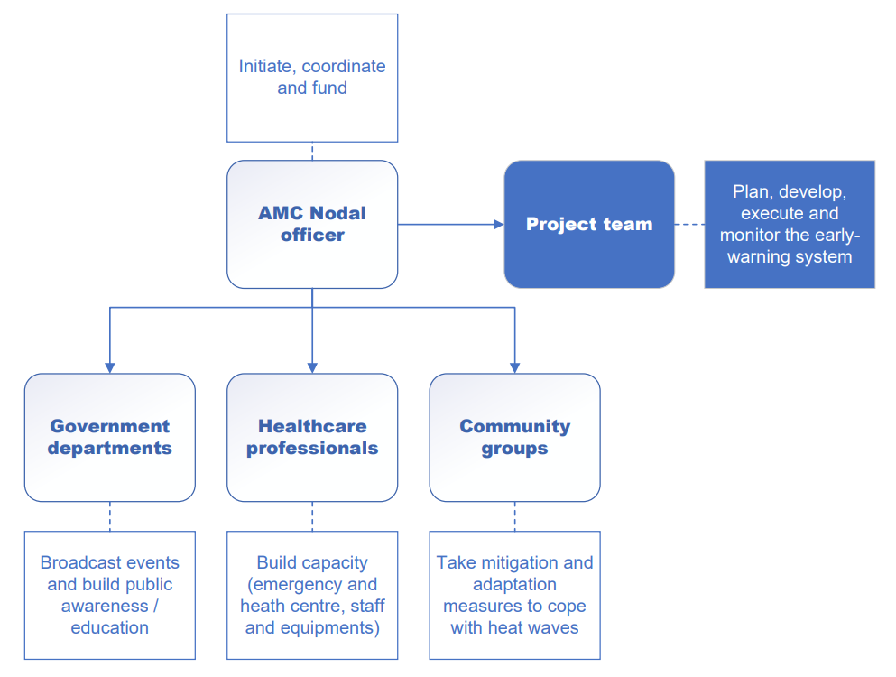
```

---
## Project timeline
```{r echo=FALSE, out.width='110%', fig.align='center', fig.cap='Work Package 1&2'}
knitr::include_graphics('images/GANT1.gif')
```

WP1 and WP2 will be delivered in the first 4 months. 

---
## Project timeline (cont.)
Deliverable = **a heat vulnerability dashboard for informal settlements** with **a clear standard operating procedure (SOP)** for consistency in future maintenance and operation.

```{r echo=FALSE, out.width='110%', fig.align='center', fig.cap='Work Package 3'}
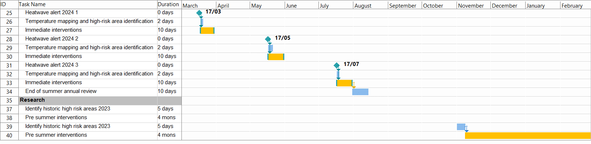
```

WP3 is the actual operation of the model after handing over. 

---
## Budget plan
**Costs**
```{r echo=FALSE, out.width='100%'}
xaringanExtra::use_panelset()

cost<- read.csv("COST.csv", 
                         header = TRUE, 
                         sep = ",",  
                         encoding = "latin1")
```

.panelset[

.panel[.panel-name[Human capital]

```{r echo=FALSE, out.width='100%'}
human<-cost[2:4,]

knitr::kable(head(human), format = 'html')
```
]
.panel[.panel-name[Data & Equipment]
```{r echo=FALSE, out.width='100%'}
equip<-cost[6:8,]

knitr::kable(head(equip), format = 'html')
```

]
.panel[.panel-name[Other]
```{r echo=FALSE, out.width='100%'}
other<-cost[10:11,c(1,4)]

knitr::kable(head(other), format = 'html')
```
]
.panel[.panel-name[Total]
```{r echo=FALSE, out.width='100%'}
total<-cost[12,c(1,4)]

knitr::kable(head(total), format = 'html')
```
]
.panel[.panel-name[peryear]
```{r echo=FALSE, out.width='100%'}
peryear<-cost[13:19,]

knitr::kable(head(peryear), format = 'html')
```

]
]


---
## Budget plan
**Benefits**

.panelset[

.panel[.panel-name[Short-term]
- Reduce heat-related illness and mortality rate with rapid response to the heatwaves 
]
.panel[.panel-name[Long-term]
- Prevent economic loss through efficient resource allocation and savings in urgent heat response costs
- Provide equitable support to vulnerable groups
]
.panel[.panel-name[Value for money]
- Our system will be in operation for the future *5-10 years* within the £500,000 budget, supporting the HAP in mitigating social, economic and environmental loss caused by heatwaves. 
- Cost of building and testing the model (first year) = *£130,000*
- Cost of maintenance and operation = approx. *£40,000* per year 
  - Future maintenance will not cost as much as the first year since the model is developed and the plan is constructed.

]
]

---
## Challenges, solutions and future work
**The government currently does not have a GIS team to maintain and operate the system.**

> A user-friendly interface / SOP for the government (esp. Nodal Officers) will be developed and the reproducibility of the model will be guaranteed before handing over. 

> One contractor will be recruited to operate the system. Although one GIS specialist is prefered, the system could be used by anyone with clear SOP. 

**The benefits of deploying our model is not clear in the short-term.**

> Annual reviews at the end of heat season will be conducted by the HAP team. 

> Secondary assessment on the impacts can be conducted. 

---
## Quality / risk management
```{r echo=FALSE, out.width='100%', fig.align='center'}
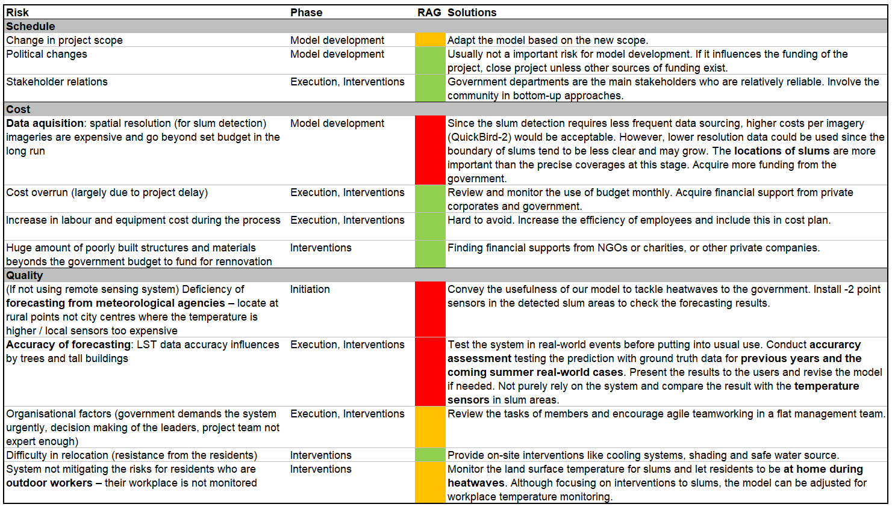
```

---
## Key risks and mitigation solutions 

**High spatial resolution imageries for slum detection are expensive to acquire and may go beyond set budget in the long run.**
> Since the slum detection requires less frequent data sourcing, higher costs per imagery (QuickBird-2) would be acceptable. However, lower resolution data could be used since the boundary of slums tend to be less clear and may grow. The locations of slums are more important than the precise coverages at this stage. Otherwise, acquire more funding from the government.

**Deficiency of current approach to forecast temperature based on meteorological agencies (which usually locate at rural areas rather than city centres where the temperature is higher).** 
> Convey the usefulness of our model to tackle heatwaves to the government. Install sensors in the detected slum areas to check the forecasting results.

---
## Key risks and mitigation solutions (cont.)

**Model accuracy is influenced by trees and tall buildings in surface temperature data.**
>Test the system in real-world events before putting into normal use. Conduct accurarcy assessment testing the prediction with ground truth data for previous years and the coming summer real-world cases. Present the results to the users and revise the model if needed. Not purely rely on the system and compare the result with the temperature sensors in slum areas. 

**Our system does not mitigating heat-related risks for residents who are outdoor workers as their workplace is not monitored.**
> Monitor the land surface temperature for slums and let residents to be at home during heatwaves. Although focusing on interventions to slums, the model can be adjusted for workplace temperature monitoring if needed.

---
## Summary
.pull-left[
Strength: 

- Identify **vulnerable locations** where the government administration has low regulatory power on. 
- Recommend **efficient solution of resource allocation** during heatwave.
- Inform the relevant departments with precise areas of focus to avoid inefficient resource allocation. 
]

.pull-right[
Weakness:

- Temperature prediction triggered by the alerts from weather stations and sensors can be slightly lagged in response. 
- LST from EO may not represent the ambient temperature. 
]

.pull-left[
Opportunity: 

- The system could be improved in the long term with increased real-time data to **predict** heatwaves through deep learning on past data and **build resilience** during disaster.
]

.pull-right[
Threat: 

- Possibility of misclassification on areas of high risks (which can be iteratively improved with increasing amount of data).
]
---
## Appendix

* Alternative Model for slum detection

```{r echo=FALSE, out.width='40%', fig.align='center'}
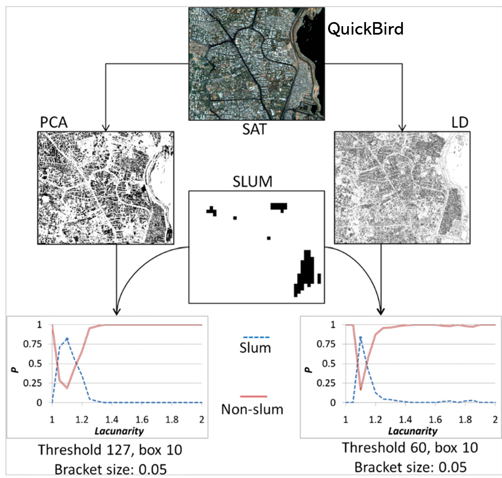
```
<small>Source: `r Citet(myBib, "kit2012")`</small>

It would need more fund, human capital and time.
---
## Reference 


```{r results='asis', echo=FALSE, warning=FALSE}
PrintBibliography(myBib, start = 1, end = 7)
```

