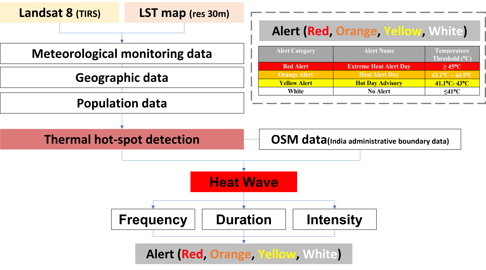
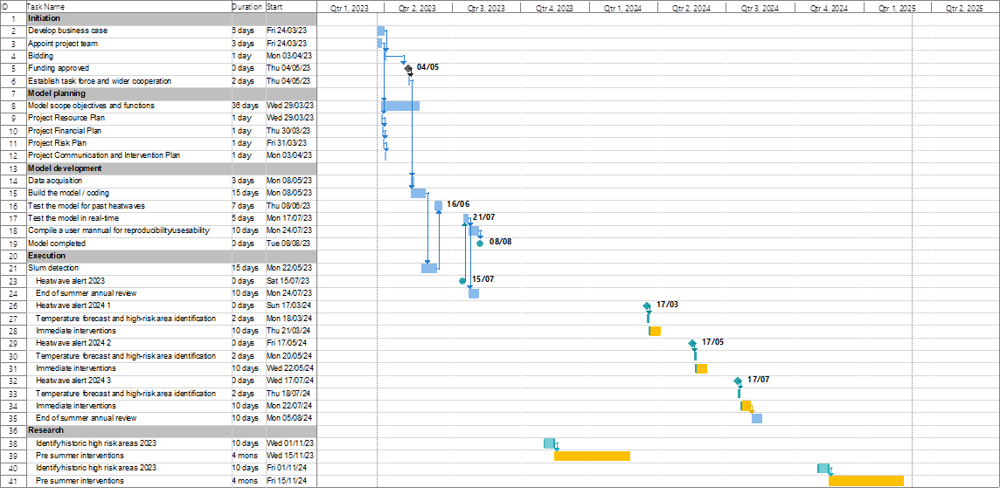

```{r echo=FALSE}
library(RefManageR)
BibOptions(check.entries = FALSE,
           bib.style = "authoryear",
           cite.style = "authoryear",
           style = "markdown",
           hyperlink = TRUE,
           dashed = FALSE,
           max.names = 2,
           no.print.fields=c("doi", "url", "urldate", "issn"))
myBib <- ReadBib("./Library.bib", check = FALSE)
```

---
## Background 
.pull-left[
### Ahmadabad 
- Most populous city in India
- 5.5 million in 2011 `r Citep(myBib, "chandramouli2011census")`
- Est. 8 million in 2023
- City's growth from the textile industry in 1860's `r Citep(myBib, "barua2018legacies")`
- Cotton industry migrants in slums and *Chawls*
- Estimated 34% live in slums or *chawls* (low-quality housing) `r Citep(myBib, "killemsetty2013understanding")`
]

.pull-right[
```{r echo=FALSE, out.width='75%', fig.align='top, right'}
knitr::include_graphics('images/Layout1.png')
```
]

### The 2010 heatwave
- Temperature soared to 46.8 degree celcius 
- Heat-related excess mortality of 1344 people  `r Citep(myBib, "azhar2014heat")`
- first Heat Action plan published in 2013

---
## 2019 Heat Action Plan (6th iteration)
### Four-pronged Strategy
- to increase public awareness and to communicate the risk of heat waves 
- to initiate an early warning system 
- to increase the capacity among health care professionals and 
- to reduce health exposure and promote adaptive measures 

### Ethos of the HAP = Protection of the vulnerable population
- Thus, **identification of high risk neighbourhoods** before the arrival of the summer is a key priority
- The HAP identifies outdoor workers, low-income communities or slum communities amongst the most vulnerable

---
## Problem statement
- Slums likely to have increased due to population growth, despite efforts to upgrade existing slums
- Census data is already outdated 
- The city's boundary expanded twice since last census, incorporating peripheral villages and municipalities 
- The locations of slums are unclear and need updated. 
- Urban geometry can contribute to heat islands and intra-urban temperature differences. (up to 6 degree in Delhi) `r Citep(myBib, "yadav2018spatial")`


## Objective of the proposal
**Systematically identify the areas of high risk and vulnerable populations and neighbourhoods**, using EO data and incorporating into the City's workflow
---

### Compliance
- Sustainable Development Goals 11

### Benefits to the city
- Growing population, outdated census 
- Provide much needed information about the vulnerable communities in a systematic way

### Climate change
- Increased exposure to extreme weather, incl. heatwave
- Impacts on the physical, natural and social systems
- Threats to food and water security

---
## Overview of our proposed workflow
```{r echo=FALSE, out.width='100%', fig.align='center'}
knitr::include_graphics('images/workflow.png')
```

---
## Overview of HAP Workflow (Ahmedabad 2019)
### Pre-Heat Season (Jan-Mar)
- AMC Nodal Officer coordinates inter-agency communications
- Health Department and Medical Professionals educate and prepare heat-related procedures
- 108 Emergency Service builds public awareness and **identifies vulnerable areas**

### Heat Season (March-July)
- **AMC Nodal Officer activates heat alerts when extreme heat events are forecast** + activates cooling centres and night shelters
- Community groups check on each other

### Post-Heat Season (July-Sept)
- AMC Nodal Officer conducts evaluation and identifies key areas for improvement.

---
## Slums Detection

### Data

* EO data
  * High resolution imagery: from the [QuickBird satellite](https://earth.esa.int/eogateway/missions/quickbird-2)
> The QuickBird sensor provides a geometric resolution of 0.60 m in panchromatic mode and therefore basically allows for a delineation of the objects in slums `r Citep(myBib,"taubenbock2014")`.
  * Landsat MSS, TM, ETM+ 
  *	TerraSAR-X data, available [here](https://earth.esa.int/eogateway/missions/terrasar-x-and-tandem-x#data-section)

* Spatial data
  *	Street network: from the [OpenStreetMap](https://www.openstreetmap.org/#map=5/54.910/-3.432)

---
## Slums Detection
.pull-left[
### Workflow
```{r echo=FALSE, out.width='90%', fig.align='center'}
knitr::include_graphics('images/workflow_slum.png')
```
]
--
.pull-right[
### Expected results
```{r echo=FALSE, out.width='100%', fig.align='center'}
knitr::include_graphics('images/result1-slum.png')
```
.small[General slums boundary for giving heatwave warning, Source: `r Citet(myBib, "leonita2018")`]
```{r echo=FALSE, out.width='90%', fig.align='center'}
knitr::include_graphics('images/result2-slum.png')
```
.small[Accurate slums boundary for upgrading, Source: `r Citet(myBib, "wurm2018a")`]
]

---
## Heatwave classification
### Data
* EO data from GEE
  * [Landsat 8 OLI/TIRS Collection 2](https://developers.google.com/earth-engine/datasets/catalog/LANDSAT_LC08_C02_T2_TOA)
  * MODIS

* [Meteorological data](https://mausam.imd.gov.in/ahmedabad/)
  * The average daily temperature by region
  * The average daily temperature by month (especially Summer)
  * Precipitation
  
* Census data
  * Daily death toll (excluding accidental deaths)
  * Death toll by region (e.g. ward, borough)

* Spatial data
  * Administrative boundary data:from the [OpenStreetMap](https://www.openstreetmap.org/relation/1953566#map=9/22.7298/72.3388)

---
## Heatwave classification
### Workflow : need to change but no idea 
```{r echo=FALSE, out.width='120%', fig.align='center'}

```

---
## Heatwave classification 
### Expected results
```{r echo=FALSE, out.width='120%', fig.align='center'}
knitr::include_graphics('images/heatwave_result_1.png')
```

.small[Future Heat Events and Social Vulnerability 2018, Source: `r Citet(myBib, "zotero-205")`]
---
## Integrating them (Will edit more after Young and Yifei)
**Slum detection**
The slum detection process can be conducted every 5 years, ideally before the hot season. 
- 5 years is a good period of updating the data as slums do not grow that quickly and is adequate. 
- This can be in the action plan for the Pre-Heat Season (January- March) where they prepare for the heat season.
- Cloud cover is lowest in January, which is when the data collection process should start. 
- There should be sufficient time for the slum detection process to finish by March.

**Temperature Monitoring** can be incorporated into the Nodal Officer’s workflow of monitoring and predicting extreme heat events.
- First output of a vulnerability map can be updated yearly (pre-HS) with previous year's data
- Second output of a real-time prediction model can be updated daily (HS) based on Meteorological Department's forecasts
- Both outputs serve to help direct heat mitigation resources to the most vulnerable areas


---
class: inverse, center, middle

# Project Management

--
.pull-left[
**Reliable** 

**Sustainable** 

**Cost-effective**
]
--
.pull-right[
- Stakeholders engagement

- Timeline

- Spending plan

- Quality control 
]
---
class: center, middle

# Stakeholders engagement

```{r echo=FALSE, out.width='90%', fig.align='center'}
knitr::include_graphics('images/stakeholder.png')
```

---
class: center, middle

# Project timeline
```{r echo=FALSE, out.width='100%', fig.align='center'}

```
---
class: center, middle

# Budget plan

---
class: center, middle

# Quality / risk management
```{r echo=FALSE, out.width='100%', fig.align='center'}
knitr::include_graphics('images/risk.png')
```
---
class: center, middle
# Summary
```{r echo=FALSE, out.width='100%', fig.align='center'}
knitr::include_graphics('images/workflow.png')
```

