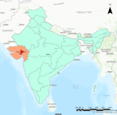

```{r echo=FALSE}
library(RefManageR)
BibOptions(check.entries = FALSE,
           bib.style = "authoryear",
           cite.style = "authoryear",
           style = "markdown",
           hyperlink = TRUE,
           dashed = FALSE,
           no.print.fields=c("doi", "url", "urldate", "issn"))
myBib <- ReadBib("./Library.bib", check = FALSE)
```

---
class: center, middle

# Introduction

city

goals

outline

benefit

etc.

---
## Background 
### Ahmadabad 
- Most populous city in India, with 5.5 million (Census 2011)
.pull-right[
```{r echo=FALSE, out.width='40%', fig.align='right'}

```
]
- Estimated to have grown to 8 million
- Cotton industry migrants
- 34% live in slums or chawls

### The 2010 heatwave
- Temperature soared to 46.8 degree celcius 
- Heat-related excess mortality of 1344 people
- first Heat Action plan published in 2013

### 2019 Heat Action Plan strategies 
- to increase public awareness and to communicate the risk of heat waves 
- to initiate an early warning system 
- to increase the capacity among health care professionals and 
- to reduce health exposure and promote adaptive measures 

---

### Problem statement and objective
- Protection of the vulnerable population is the centre of the HAP.
- Thus, listing high risk areas before the arrival of the summer is required
- Goal: Systematically identify the areas of high risk and vulnerable populations and neighbourhoods


### Compliance
- Sustainable Development Goals 11

### Benefits to the city
- Growing population, outdated census 
- Provide much needed information about the vulnerable communities in a systematic way

---
class: center, middle

# Wokflow

overview

slum

temperature

---
## Overview of HAP Workflow (Ahmedabad 2019)
### Pre-Heat Season (Jan-Mar)
- AMC Nodal Officer coordinates inter-agency communications
- Health Department and Medical Professionals educate and prepare heat-related procedures
- 108 Emergency Service builds public awareness and **identifies vulnerable areas**

### Heat Season (March-July)
- **AMC Nodal Officer activates heat alerts when extreme heat events are forecast** + activates cooling centres and night shelters
- Community groups check on each other

### Post-Heat Season (July-Sept)
- AMC Nodal Officer conducts evaluation and identifies key areas for improvement.

---
## Slums Detection

### Data

* EO data
  * High resolution imagery: from the [QuickBird satellite](https://earth.esa.int/eogateway/missions/quickbird-2)
> The QuickBird sensor provides a geometric resolution of 0.60 m in panchromatic mode and therefore basically allows for a delineation of the objects in slums `r Citep(myBib,"taubenbock2014")`.
  * Landsat MSS, TM, ETM+ 
  *	TerraSAR-X data, available [here](https://earth.esa.int/eogateway/missions/terrasar-x-and-tandem-x#data-section)

* Spatial data
  *	Street network: from the [OpenStreetMap](https://www.openstreetmap.org/#map=5/54.910/-3.432)

---
.pull-left[
### Workflow

```{r echo=FALSE, out.width='120%', fig.align='center'}
knitr::include_graphics('images/workflow_slum.png')
```
]

--
.pull-right[
### Expected results

```{r echo=FALSE, out.width='100%', fig.align='center'}
knitr::include_graphics('images/result1-slum.png')
```

.small[General slums boundary for giving heatwave warning, Source: `r Citet(myBib, "leonita2018")`]

```{r echo=FALSE, out.width='100%', fig.align='center'}
knitr::include_graphics('images/result2-slum.png')
```

.small[Accurate slums boundary for upgrading, Source: `r Citet(myBib, "wurm2018a")`]

]
---
## Temperature workflow

```{r echo=FALSE, out.width='100%', fig.align='center'}
knitr::include_graphics('images/temp_workflow.png')
```

---
## Ahmedbad Heat Action Plan

```{r echo=FALSE, out.width='95%', fig.align='center', cache=TRUE, fig.cap="Source: [Ahmedabad Heat Action Plan 2019](https://www.nrdc.org/sites/default/files/ahmedabad-heat-action-plan-2019-update.pdf)"}
knitr::include_graphics('images/temp_alert.png')
```


---
## Integrating them (Will edit more after Young and Yifei)
**Slum detection**
The slum detection process can be conducted every 5 years, ideally before the hot season. 
- 5 years is a good period of updating the data as slums do not grow that quickly and is adequate. 
- This can be in the action plan for the Pre-Heat Season (January- March) where they prepare for the heat season.
- Cloud cover is lowest in January, which is when the data collection process should start. 
- There should be sufficient time for the slum detection process to finish by March.

**Temperature Monitoring**
Temperature monitoring can be done via remote sensors, and we can incorporate it into the Nodal Officer’s workflow of monitoring and predicting extreme heat events.
(ok sorry will edit based on whether this is updated during heat season or before)

---
class: inverse, center, middle

# Project Management

--
.pull-left[
**Reliable** 

**Sustainable** 

**Cost-effective**
]
--
.pull-right[
- Stakeholders engagement

- Timeline

- Spending plan

- Quality control 
]
---
class: center, middle

# Stakeholders engagement

```{r echo=FALSE, out.width='90%', fig.align='center'}
knitr::include_graphics('images/stakeholder.png')
```

---
class: center, middle

# Project timeline
```{r echo=FALSE, out.width='100%', fig.align='center'}
knitr::include_graphics('images/GANT.png')
```
---
class: center, middle

# Budget plan

---
class: center, middle

# Quality / risk management
```{r echo=FALSE, out.width='100%', fig.align='center'}
knitr::include_graphics('images/risk.png')
```
---
class: center, middle
# Summary
```{r echo=FALSE, out.width='100%', fig.align='center'}
knitr::include_graphics('images/workflow.png')
```

