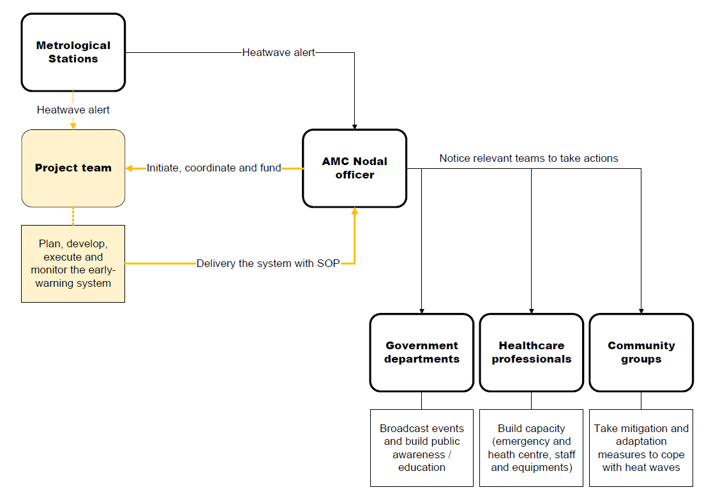

some function here

such as bib

---
class: center, middle

# Introduction

city

goals

outline

benefit

etc.

---

Atsumi's part

---

Atsumi's part

---
class: center, middle

# Wokflow

overview

temperature

slums

xxx

---

## overview

josiah's part

---
## Temperature

Young's part

---

Young's part

---
## Slums

Yifei's part

---

Yifei's part

---
## intregate them 

josiah's part

---
class: inverse, center, middle

# Project Management

--
.pull-left[
**Reliable** 

**Sustainable** 

**Cost-effective**
]
--
.pull-right[
- Stakeholders engagement

- Timeline

- Spending plan

- Quality control 
]
---
class: center, middle

# Stakeholders engagement

```{r echo=FALSE, out.width='90%', fig.align='center'}

```

---
class: center, middle

# Project timeline
```{r echo=FALSE, out.width='100%', fig.align='center'}
knitr::include_graphics('images/GANT.png')
```
---
class: center, middle

# Budget plan

---
class: center, middle

# Quality / risk management
```{r echo=FALSE, out.width='100%', fig.align='center'}
knitr::include_graphics('images/risk.png')
```
---
class: center, middle
# Summary
```{r echo=FALSE, out.width='100%', fig.align='center'}

```