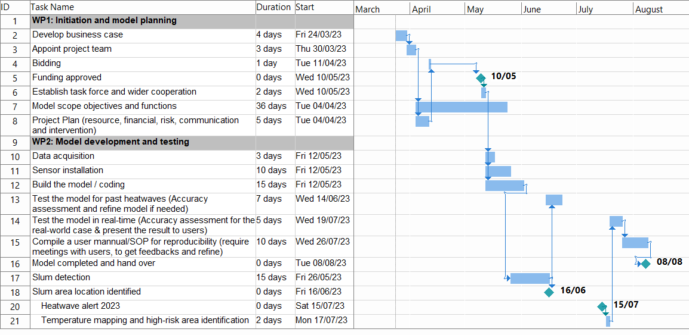

```{r echo=FALSE}
library(RefManageR)
BibOptions(check.entries = FALSE,
           bib.style = "authoryear",
           cite.style = "authoryear",
           style = "markdown",
           hyperlink = TRUE,
           dashed = FALSE,
           no.print.fields=c("doi", "url", "urldate", "issn"))
myBib <- ReadBib("./Library.bib", check = FALSE)
```

class: center, middle

# Introduction

city

goals

outline

benefit

etc.

---
class: inverse, center, middle

# Problem definition 
---
## Background 
### Ahmadabad 
- Most populous city in India, with 5.5 million (Census 2011)
.pull-right[
```{r echo=FALSE, out.width='40%', fig.align='right'}
#knitr::include_graphics('images/ahmedabad.png')
```
]
- Estimated to have grown to 8 million
- Cotton industry migrants
- 34% live in slums or chawls
(- Area 505 km2)

### The 2010 heatwave
- Temperature soared to 46.8 degree celcius 
- Heat-related excess mortality of 1344 people
- first Heat Action plan published in 2013

### 2019 Heat Action Plan strategies 
- to increase public awareness and to communicate the risk of heat waves 
- to initiate an early warning system 
- to increase the capacity among health care professionals and 
- to reduce health exposure and promote adaptive measures 

---

### Problem statement and objective
- Protection of the vulnerable population is the centre of the HAP.
- Thus, listing high risk areas before the arrival of the summer is required
- Goal: Systematically identify the areas of high risk and vulnerable populations and neighbourhoods

### Compliance
- Sustainable Development Goals 11

### Benefits to the city
- Growing population, outdated census 
- Provide much needed information about the vulnerable communities in a systematic way

---
class: inverse, center, middle

# Approach
---
## Overview of our proposed workflow
```{r echo=FALSE, out.width='100%', fig.align='center'}
knitr::include_graphics('images/workflow.png')
```

---
## Overview of HAP Workflow (Ahmedabad 2019)
### Pre-Heat Season (Jan-Mar)
- AMC Nodal Officer coordinates inter-agency communications
- Health Department and Medical Professionals educate and prepare heat-related procedures
- 108 Emergency Service builds public awareness and **identifies vulnerable areas**

### Heat Season (March-July)
- **AMC Nodal Officer activates heat alerts when extreme heat events are forecast** + activates cooling centres and night shelters
- Community groups check on each other

### Post-Heat Season (July-Sept)
- AMC Nodal Officer conducts evaluation and identifies key areas for improvement.

---
## Slums Detection

### Data

* EO data
  * High resolution imagery: from the [QuickBird satellite](https://earth.esa.int/eogateway/missions/quickbird-2)
> The QuickBird sensor provides a geometric resolution of 0.60 m in panchromatic mode and therefore basically allows for a delineation of the objects in slums `r Citep(myBib,"taubenbock2014")`.
  * Landsat MSS, TM, ETM+ 
  *	TerraSAR-X data, available [here](https://earth.esa.int/eogateway/missions/terrasar-x-and-tandem-x#data-section)

* Spatial data
  *	Street network: from the [OpenStreetMap](https://www.openstreetmap.org/#map=5/54.910/-3.432)

---
## Slums Detection
.pull-left[
### Workflow
```{r echo=FALSE, out.width='90%', fig.align='center'}
knitr::include_graphics('images/workflow_slum.png')
```
]
--
.pull-right[
### Expected results
```{r echo=FALSE, out.width='100%', fig.align='center'}
knitr::include_graphics('images/result1-slum.png')
```
.small[General slums boundary for giving heatwave warning, Source: `r Citet(myBib, "leonita2018")`]
```{r echo=FALSE, out.width='90%', fig.align='center'}

```
.small[Accurate slums boundary for upgrading, Source: `r Citet(myBib, "wurm2018a")`]
]

---
## Heatwave classification
### Data
* EO data from GEE
  * [Landsat 8 OLI/TIRS Collection 2](https://developers.google.com/earth-engine/datasets/catalog/LANDSAT_LC08_C02_T2_TOA)
  * MODIS

* [Meteorological data](https://mausam.imd.gov.in/ahmedabad/)
  * The average daily temperature by region
  * The average daily temperature by month (especially Summer)
  * Precipitation
  
* Census data
  * Daily death toll (excluding accidental deaths)
  * Death toll by region (e.g. ward, borough)

* Spatial data
  * Administrative boundary data:from the [OpenStreetMap](https://www.openstreetmap.org/relation/1953566#map=9/22.7298/72.3388)

---
## Heatwave classification
### Workflow : need to change but no idea 
```{r echo=FALSE, out.width='120%', fig.align='center'}
knitr::include_graphics('images/temp_workflow.png')
```

---
## Heatwave classification 
### Expected results
```{r echo=FALSE, out.width='120%', fig.align='center'}
knitr::include_graphics('images/heatwave_result_1.png')
```

.small[Future Heat Events and Social Vulnerability 2018, Source: `r Citet(myBib, "zotero-205")`]
---
## Integrating them 
**Slum detection** can be conducted every 5 years, ideally before the hot season. 
- 5 years is a good period of updating the data as slums do not expand that quickly and is adequate. 
- This can be in the action plan for the Pre-Heat Season (January- March) where they prepare for the heat season.
- Cloud cover is lowest in January, which is when the data collection process should start. 
- There should be sufficient time for the slum detection process to finish by March.

**Temperature Monitoring** can be incorporated into the Nodal Officer’s workflow of monitoring and predicting extreme heat events.
- First output of a vulnerability map can be updated yearly (pre-HS) with previous year's data
- Second output of a real-time prediction model can be updated daily (HS) based on Meteorological Department's forecasts
- Both outputs serve to help direct heat mitigation resources to the most vulnerable areas

---
class: inverse, center, middle

# Project plan, risks and value for money

--
.pull-left[
**Reliable** 

**Cost-effective**

**Sustainable** 
]
--
.pull-right[
- Timeline & Stakeholder

- Budgeting

- Quality control 
]
---
class: left, middle

## Stakeholders engagement
```{r echo=FALSE, out.width='100%', fig.align='center'}
knitr::include_graphics('images/stakeholder.png')
```

---
class: left, middle
## Project timeline
```{r echo=FALSE, out.width='110%', fig.align='center'}

```
---
class: left, middle

## Project timeline (cont.)
```{r echo=FALSE, out.width='110%', fig.align='center'}
knitr::include_graphics('images/GANT2.gif')
```

---
class: left, middle
## Future area of work / challenges
- The government currently does not have a GIS team to maintain and operate the system.

Our solution
> A user-friendly interface / SOP for the government (esp. Nodal Officers) will be developed. 

> The reproducibility of the model will be guaranteed before handing over. 

> One contractor could be recruited to ensure proper deployment of the system. 

---
class: left, middle
## Quality / risk management
```{r echo=FALSE, out.width='100%', fig.align='center'}
knitr::include_graphics('images/risk.png')
```

---
class: left, top
## Budget plan
.pull-left[
**Costs** (for the first year)

Human capital
- 1 Project manager (ad-hoc team): £14,640 (488h)
- 1 Model developer (ad-hoc team): £17,600 (440h)
- 1 GIS specialist (government contractor): £19,680 (328h)

Data & Equipment
- QuickBird-2 (£14.5 per sq km): £12,625
- Sensors: £3,000
- Computers and IT: £12,000

Space/rent
- Rent: £1 (in government office / remote)
]

.pull-right[
**Benefits**

Short-term: 
- Reduce heat-related illness and mortality rate with rapid response to the heatwaves 

Long-term: 
- Prevent economic loss through efficient resource allocation and savings in urgent heat response costs
- Provide equitable support to vulnerable groups
]

---
class: left, middle
## Budget plan

- Cost of building and testing the model (first year) = £79,546
- Cost of maintenance and operation = approx. *£18,000* per year 
  - Future maintenance will not cost as much as the first year since the model is developed and the plan is constructed.

Value for money
> Our system will be in operation for the future 15-20 years within the £500,000 budget, supporting the HAP in mitigating social, economic and environmental loss caused by heatwaves. 

---
class: left, middle
## Summary
SWOT of our model
.pull-left[
Strength: 

Identify **vulnerable locations** where the government administration has low regulatory power on. Inform the relevant departments with precise areas of focus to avoid inefficient resource allocation. 
]

.pull-right[
Weakness:

Temperature prediction triggered by the alerts from weather stations and sensors can be slightly lagged in response.
]

.pull-left[
Opportunity: 

The system could be improved in the long term with increased real-time data to **predict** heatwaves through deep learning on past data and **build resilience** during disaster.
]

.pull-right[
Threat: 

Possibility of misclassification on areas of high risks (which can be iteratively improved with increasing amount of data).
]

