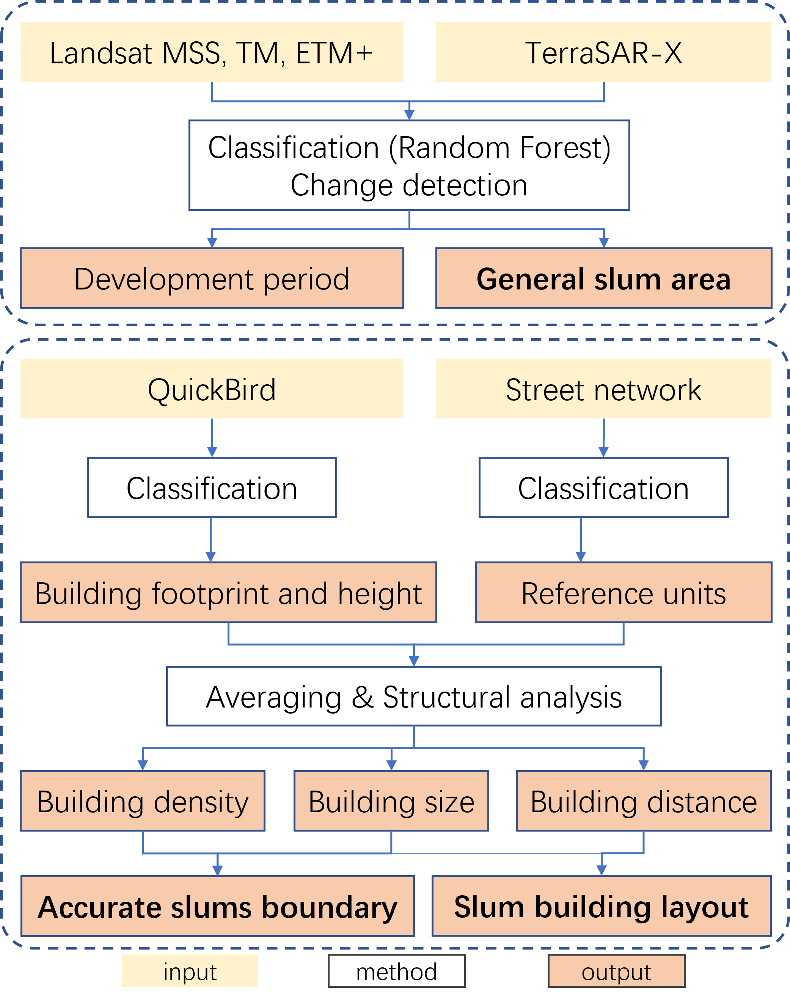

```{r echo=FALSE}
library(RefManageR)
BibOptions(check.entries = FALSE,
           bib.style = "authoryear",
           cite.style = "authoryear",
           style = "markdown",
           hyperlink = TRUE,
           dashed = FALSE,
           no.print.fields=c("doi", "url", "urldate", "issn"))
myBib <- ReadBib("./Library.bib", check = FALSE)
```

class: center, middle

# Introduction

city

goals

outline

benefit

etc.

---

Atsumi's part

---

Atsumi's part

---
class: center, middle

# Wokflow

overview

temperature

slums

xxx

---

## overview

josiah's part

---
## Temperature

Young's part

---

Young's part

---
## Slums Detection

### Objective

identify the slums boundary

### Data

* EO data
  * high resolution imagery: from the [QuickBird satellite](https://earth.esa.int/eogateway/missions/quickbird-2)
> The QuickBird sensor provides a geometric resolution of 0.60 m in panchromatic mode and therefore basically allows for a delineation of the objects in slums `r Citep(myBib,"taubenbock2014")`.
  * Landsat MSS, TM, ETM+ 
  *	TerraSAR-X data, available [here](https://earth.esa.int/eogateway/missions/terrasar-x-and-tandem-x#data-section)

* Spatial data
  *	Street network: from the [OpenStreetMap](https://www.openstreetmap.org/#map=5/54.910/-3.432)

---
.pull-left[
### Work flow

```{r echo=FALSE, out.width='120%', fig.align='center'}

```
]

--
.pull-right[
### Expective resuls

```{r echo=FALSE, out.width='80%', fig.align='center'}
knitr::include_graphics('images/result1-slum.png')
```

.small[general slums boundary for giving heatwave warning, Source: `r Citet(myBib, "leonita2018")`]

```{r echo=FALSE, out.width='80%', fig.align='center'}
knitr::include_graphics('images/result2-slum.png')
```

.small[Accurate slums boundary for renovation, Source: `r Citet(myBib, "wurm2018a")`]

]
---
## integrate them 

josiah's part

---
class: center, middle

# Management

timelines

spending plan

stakeholders engagement

---

Yi-chein's part

---

Yi-chein's part

---

Yi-chein's part

---
class: center, middle
# Summary

